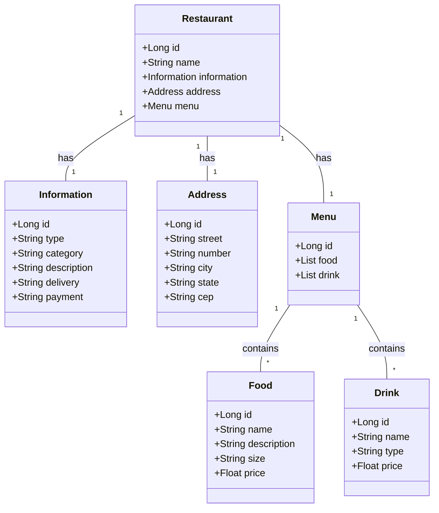

# Santander Bootcamp 2024 - Backend Java

Restful API para para gerenciamento de restaurantes, cardápios e itens, desenvolvido durante o bootcamp disponibilizado pelo [Santander](https://www.santanderopenacademy.com) e [DIO](https://web.dio.me) em Java 17 e Spring Boot 3.

## Principais Tecnologias

---

- **Java 17**: Utilizado a versão mais recente do Java para tirar vantagem das últimas novidades e melhores práticas.
- **Spring Boot 3**: Utilizado a versão mais recente do Spring Boot maximizando a produtividade devido a premissa de autoconfiguração.
- **Spring Data JPA**: Utilizado para simplificar a camada de acesso aos dados, facilitando a integração com o banco de dados SQL.
- **PostgreSQL**: Utilizado como banco de dados SQL, com suporte a transações e ACID.
- **H2 Database**: Utilizado como banco de dados SQL em desenvolvimento, para facilitar a integração e testes.
- **OpenAPI (Swagger)**: Utilizado para gerar documentação da API, facilitando a compreensão da API e a sua utilizção.
- **Railway**: Facilita o deploy e monitoramento da solução na nuvem, e oferece diversos bancos de dados como serviço e pipelines de CI/CD.

## Diagrama de Classes (Domínio da API)

---

